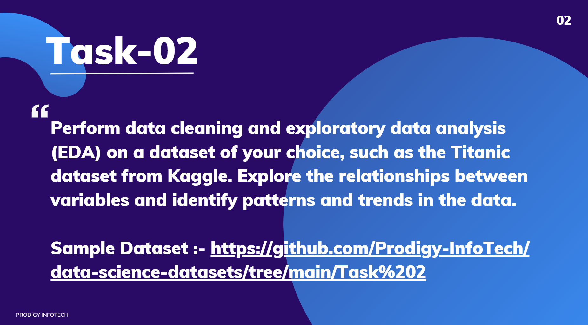

# PRODIG_DS_02

# Prodigy Infotech – Data Science Internship (Task 2)

Hi there!  
I'm **Sarankumar**, and this repository showcases my submission for **Task 2** of the **Prodigy Infotech Data Science Internship**. In this task, I performed **Data Loading**, **Data Cleaning**, and **Exploratory Data Analysis (EDA)** on the famous Titanic dataset to uncover important insights and visualize passenger characteristics.

---

## 🌍 About the Dataset

I worked with the [**Titanic Dataset**](https://www.kaggle.com/c/titanic/data), which contains information about passengers aboard the RMS Titanic. Some of the key features include:

- PassengerId  
- Survived (target variable)  
- Pclass (ticket class)  
- Name  
- Sex  
- Age  
- SibSp (siblings/spouses aboard)  
- Parch (parents/children aboard)  
- Fare  
- Embarked (port of embarkation)  
... and more!

---

## 🧰 Tools & Libraries

This project was completed using Python in a Jupyter Notebook environment, with the help of:

- `pandas` and `numpy` for data handling and cleaning  
- `matplotlib` and `seaborn` for visualization  
- Jupyter Notebook for coding and presenting the analysis  

---

## 🔍 What I Did – A Quick Walkthrough

### 1. **Getting to Know the Data**
- Loaded the Titanic dataset using `pandas`  
- Explored its structure, data types, and checked for missing values

### 2. **Cleaning the Data**
- Dropped rows missing critical fields like `Embarked`  
- Filled missing values in `Age` and replaced missing `Cabin` entries with "Unknown"

### 3. **Exploratory Data Analysis**
- Visualized distributions such as Age and Fare  
- Analyzed survival counts by gender using plots  
- Created scatter plots to explore relations, e.g., Age vs. Fare

*Note:* A "Survived" column was added with random values for visualization purposes; **no machine learning model was trained or evaluated in this project.**

---

## 🎯 Conclusion

This task focused on exploring and understanding the Titanic dataset by cleaning data and generating insightful visualizations. It provided valuable experience in data preprocessing and exploratory analysis.

---

Thanks for stopping by and reviewing my work! 😊
